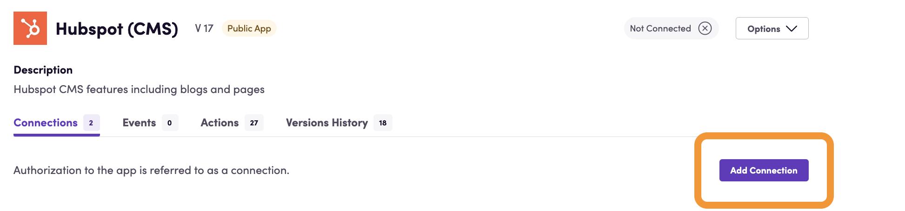
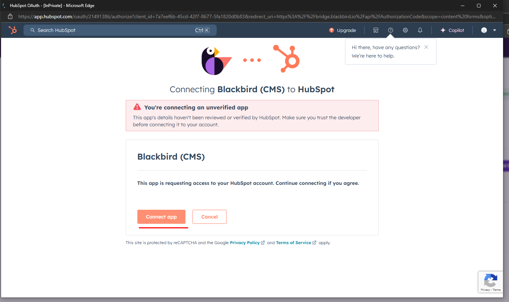
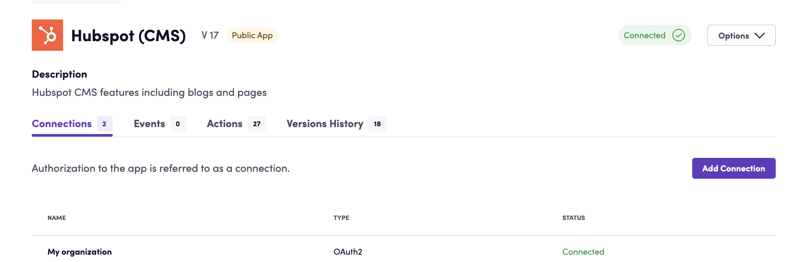
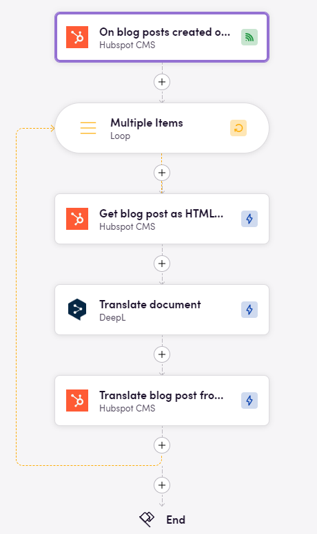
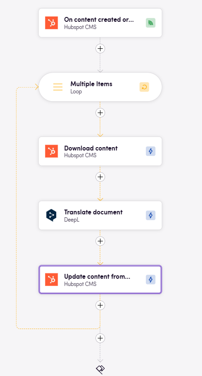

# Blackbird.io Hubspot CMS

Blackbird is the new automation backbone for the language technology industry. Blackbird provides enterprise-scale automation and orchestration with a simple no-code/low-code platform. Blackbird enables ambitious organizations to identify, vet and automate as many processes as possible. Not just localization workflows, but any business and IT process. This repository represents an application that is deployable on Blackbird and usable inside the workflow editor.

## Introduction

<!-- begin docs -->

HubSpot CMS is a user-friendly platform designed to streamline the process of creating, managing, and optimizing digital content for websites. It offers a range of tools that allow businesses to build and customize their online presence without requiring extensive technical expertise. The platform's intuitive drag-and-drop interface facilitates effortless content creation and editing, and it emphasizes inbound marketing strategies. This makes HubSpot CMS a valuable solution for businesses aiming to enhance their online presence, engage their audience, and drive meaningful conversions.

With multilingual content management, global content modules, and content personalization features, HubSpot CMS makes it easy to adapt digital content for different languages and regions. Now, with a seamless connection from Blackbird.io, businesses can effortlessly synchronize and manage their content, data, and marketing strategies across platforms. Achieve higher levels of operational efficiency, reduce manual efforts, and ensure consistent brand messaging across diverse markets.

## Before setting up

Before you can connect you need to make sure that:

- You have a HubSpot CMS account and [set up your HubSpot account](https://knowledge.hubspot.com/get-started/set-up-your-account).
- You have a [project created](https://app.hubspot.com/academy/43682681/lessons/1054824/5082).
- After creating your account, you'll automatically be logged in. [Learn more about logging](https://knowledge.hubspot.com/account/why-can-t-i-log-into-hubspot) in to HubSpot and [troubleshooting password issues](https://knowledge.hubspot.com/account/reset-user-passwords).
- Your account has sufficient permissions. See below.

## Hubspot permissions required

The app makes use of the `content` and `forms` OAuth scopes. You account needs to have access to these scopes. Your account has sufficient permissions if you are a superadmin _or_ your account has **all** of the following permissions:

- Marketing
   - Forms
   - Marketing email (view/edit/publish)
   - Blog, landing pages, website pages (view/edit/publish)
   - Design tools
   - Content staging
- Account > Settings access
   - App marketplace access
   - Website settings
   - Developer tools

> To use actions related to HubDB, your app needs to have access to `hubdb` scope.

## Connecting

1. Navigate to apps and search for **Hubspot (CMS)**.
2. Click _Add Connection_.
   
3. Name your connection for future reference e.g. 'My organization'.
4. Click _Authorize connection_.
5. Follow the instructions that HubSpot CMS gives you, authorizing Blackbird.io to act on your behalf.
6. At the last stage, Hubspot will most likely redirect you to our service without the need to press the 'Connect app' button. <b>Please wait a few seconds for this to happen and avoid pressing the button</b>, as it will duplicate the request that Hubspot has already sent and could cause a UI bug on the connection page. The new connection may appear as 'Not Connected,' but after updating the app page, the status will change to 'Connected.' If Hubspot doesn't redirect you to our service within 5-7 seconds, you can click the 'Connect app' button manually

7. When you return to Blackbird, confirm that the connection has appeared and the status is _Connected_.
   

## Actions

### Content

- **Search content** Search for any type of content.
    Advanced settings:
  - **Language ID**: Filter content by language.
  - **Created at**: Filter content created at a specific date.
  - **Created after**: Filter content created after a specific date.
  - **Created before**: Filter content created before a specific date.
  - **Updated at**: Filter content updated at a specific date.
  - **Updated after**: Filter content updated after a specific date.
  - **Updated before**: Filter content updated before a specific date.
  - **Domain equals**: Filter content by an exact domain.
  - **Domain contains**: Filter content by partial domain match.
  - **Current state**: Filter content by current state.
  - **URL contains**: Filter content by partial URL match.
  - **Slug**: Filter content by slug.
  - **Title contains**: Filter content by partial title match.
  - **Title equals**: Filter content by exact title match.
  - **Updated by user IDs (whitelist)**: Include content updated by specific users.
  - **Updated by user IDs (blacklist)**: Exclude content updated by specific users.
- **Get translation language codes** Get translation language codes for specific content by ID.
- **Get content** Retrieve metadata for a specific content type based on its ID.
- **Download content** Download content for a specific content type based on its ID.
    Advanced settings:
  - **Properties to include**: Limit downloaded content to selected properties.
  - **Properties to exclude**: Exclude selected properties from downloaded content.
- **Upload content** Update content from a processed content file.
    Advanced settings:
  - **Content ID**: Override the content ID extracted from the uploaded file.
  - **Enable internal link localization**: Update internal links to localized versions.
  - **Published site base URL**: Set the base URL used for internal link localization.
  - **Create new content**: Create new content for forms or emails instead of updating.
  - **Original item ID**: Set the source blog post or page ID to update.
  - **Update slug and meta description from file**: Update page metadata from file meta tags.
- **Update content** Update content based on specified criteria using its ID.
- **Delete content** Delete content based on its ID.

### Pages

- **Search site pages** Search site pages that match the specified filters.
    Advanced settings:
  - **Not translated in language**: Show only pages missing a translation in the selected language.
  - **Language**: Filter pages by language.
  - **Site name contains**: Filter pages by partial site name match.
  - **Site name equals**: Filter pages by exact site name.
  - **State**: Filter pages by state.
  - **A/B status**: Filter pages by A/B testing status.
  - **Url contains**: Filter pages by partial URL match.
  - **Published at**: Filter pages published at a specific date.
  - **Published after**: Filter pages published after a specific date.
  - **Published before**: Filter pages published before a specific date.
  - **Archived at**: Filter pages archived at a specific date.
  - **Archived after**: Filter pages archived after a specific date.
  - **Archived before**: Filter pages archived before a specific date.
- **Get site page translation language codes** Get translation language codes for a site page.
- **Get site page** Get details for a specific site page.
- **Get site page as HTML file** Download a site page for translation or review.
- **Translate site page from HTML file** Create or update a site page translation from a file.
    Advanced settings:
  - **Source page ID**: Use a specific source page when it cannot be extracted from the file.
  - **Primary language**: Set the primary language for pages without existing translations.
- **Schedule site-page for publishing** Schedule a site page to be published at a specific date and time.
    Advanced settings:
  - **Date time**: Set the publishing date and time.

### Landing page

- **Search landing pages** Search landing pages that match the specified filters.
- **Get landing page** Get details for a specific landing page.
- **Get landing page translation language codes** Get translation language codes for a landing page.
- **Get landing page as HTML file** Download a landing page for translation or review.
- **Translate landing page from HTML file** Create or update a landing page translation from a file.
- **Schedule landing page for publishing** Schedule a landing page to be published at a specific date and time.

### Blog posts

- **Search blog posts** Search blog posts that match the specified filters.
    Advanced settings:
  - **Only IDs**: Output only blog post IDs.
  - **Slug contains**: Filter blog posts by partial slug match.
- **Get blog post** Get details for a specific blog post.
- **Create blog post** Create a new blog post.
    Advanced settings:
  - **Archived**: Set whether the blog post is archived.
  - **Content group ID**: Set the blog content group.
  - **Campaign**: Set campaign metadata.
  - **Category ID**: Set the blog category.
  - **Name**: Set the blog post title.
  - **MAB experiment ID**: Set the multivariate test experiment.
  - **Author name**: Set the author name.
  - **AB test ID**: Set the A/B test ID.
  - **AB status**: Set the A/B testing status.
  - **Domain**: Set the page domain.
  - **Folder ID**: Set the folder ID.
  - **HTML title**: Set the HTML title.
  - **Post body**: Set the post body content.
  - **Post summary**: Set the post summary.
  - **RSS body**: Set the RSS body.
  - **RSS summary**: Set the RSS summary.
  - **Head HTML**: Set additional HTML for the head section.
  - **Footer HTML**: Set additional HTML for the footer section.
  - **Meta description**: Set the meta description.
- **Update blog post** Update an existing blog post.
- **Delete blog post** Delete a blog post.
- **Get blog post as HTML file** Download a blog post for translation or review.
- **Translate blog post from HTML file** Create or update a blog post translation from a file.
    Advanced settings:
  - **Post ID**: Use a specific post ID when it cannot be extracted from the file.
- **Schedule blog post for publishing** Schedule a blog post to be published at a specific date and time.

### Marketing emails

- **Search marketing emails** Search marketing emails that match the specified filters.
- **Create marketing email** Create a new marketing email.
    Advanced settings:
  - **Subject**: Set the email subject.
  - **Send on publish**: Send the email when it is published.
  - **Active domain**: Set the active sending domain.
  - **Publish date**: Set the email publish date.
  - **Business unit ID**: Set the business unit.
- **Get marketing email content as HTML** Download marketing email content for translation or review.
    Advanced settings:
  - **Exclude title from file**: Exclude the title from the downloaded file.
- **Update marketing email** Update marketing email properties.
    Advanced settings:
  - **Title**: Update the email title.
- **Update marketing email content from HTML** Update marketing email content from a file.
    Advanced settings:
  - **Marketing email ID**: Use a specific marketing email ID when it cannot be extracted from the file.
- **Create marketing email from HTML** Create a marketing email from a file.
    Advanced settings:
  - **Name**: Override the email name extracted from the file.

### Marketing forms

- **Search marketing forms** Search marketing forms that match the specified filters.
    Advanced settings:
  - **Form types**: Filter results by form type.
- **Get marketing form** Get a marketing form by its ID.
- **Create marketing form** Create a new marketing form.
    Advanced settings:
  - **Form type**: Set the form type.
- **Get marketing form content as HTML** Download marketing form content for translation or review.
- **Update marketing form from HTML** Update a marketing form from a file.
    Advanced settings:
  - **Form ID**: Use a specific form ID when it cannot be extracted from the file.
- **Create marketing form from HTML** Create a marketing form from a file.

### HubDB

- **Search tables** Search HubDB tables that match the specified filters.
    Advanced settings:
  - **Name contains**: Filter tables by partial table name match.
  - **Label contains**: Filter tables by partial label match.
  - **Updated after**: Filter tables updated after a specific date.
  - **Updated before**: Filter tables updated up to a specific date.
  - **Created after**: Filter tables created after a specific date.
  - **Created before**: Filter tables created up to a specific date.
  - **Updated by (User IDs)**: Filter tables by updater user IDs.
- **Export table** Download a HubDB table in the selected format.
- **Publish table** Publish a HubDB table from draft to published.
- **Search rows** Search HubDB table rows by table ID or name.
    Advanced settings:
  - **Filter query**: Apply a custom HubDB row filter query.
- **Download rows content** Download selected columns and rows from a HubDB table.
- **Update row column** Update a column value in a HubDB draft row.
    Advanced settings:
  - **Text value**: Set a Text value for the column.
  - **Numeric value**: Set a number value for the column.
  - **Date value**: Set a date value for the column.
- **Upload rows content** Create or update HubDB rows from a file.

### General

- **Debug** Output connection credentials for debugging.
- **Get connected site info** Get account information for the connected site for debugging.

## Events

### Polling

- **On content created or updated** Triggered at specified intervals and outputs content created or updated since the previous poll.
    Advanced settings:
  - **Language**: Limit polling to a specific language.
  - **Content types**: Limit polling to selected content types.
  - **Published**: Only output published content.
- **On blog posts created or updated** Triggered when a blog post is created or updated.
- **On site pages created or updated** Triggered when a site page is created or updated.
- **On landing pages created or updated** Triggered when a landing page is created or updated.
- **On marketing forms created or updated** Triggered when a marketing form is created or updated.
- **On marketing emails created or updated** Triggered when a marketing email is created or updated.

## Useful tips

All actions that work with HTML files will add a meta tag to the HTML. This meta tag is named `blackbird-reference-id`. This tag is used to identify the content in the Hubspot CMS, eliminating the need to store IDs elsewhere

## Examples

This example uses a polling event to check for new blog posts. When a new blog post is created, the event triggers and the blog post is translated into a different language.

This example demonstrates how you can work with the `Hubspot CMS` app in a generic way. This bird will pick up all updated or created content within a specified time interval and translate it into a specific language. Using this approach, you don't need to create five different birds; you can just create one for this purpose

<!-- end docs -->
